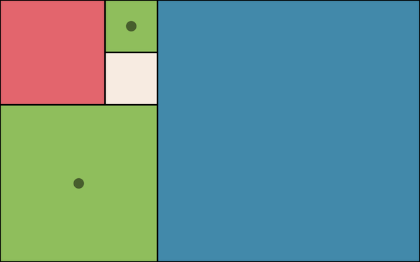

# fibonacci-clock

An impractical but satisfying way to tell the time: fibonacci-clock is a deterministic browser-based implementation of the [Fibonacci Clock Kickstarter project](https://www.kickstarter.com/projects/basbrun/fibonacci-clock-an-open-source-clock-for-nerds-wit).

## How to read the time

The 12-hour clock is divided into squares whose sizes (side lengths) correspond to the first five digits in the [Fibonacci sequence](https://en.wikipedia.org/wiki/Fibonacci_number): 1, 1, 2, 3 and 5.

The current time is encoded in the colouring of these squares. Red corresponds to hours, green corresponds to minutes, and blue corresponds to both hours and minutes. White squares can be ignored. To compute the current hour, sum the sizes of the red and blue squares. The colours encode minutes in 5-minute increments; to compute the current minute, sum the sizes of the green and blue squares, then multiply the result by 5.

To allow time to be read to the nearest minute, I added circles to the clock. The sum of the sizes of squares on which these circles sit encodes the minute remainder. The current minute is given by the sum of this remainder and the minute value encoded by the colours.

### Example

In the image above, the clock shows the time to be 07:49 (a.m. or p.m.):

- Hours (red + blue): 2 + 5 = 7
- Minutes (green + blue): (1 + 3 + 5) \* 5 = 45
- Minutes remainder (circles): 3 + 1 = 4

## Try it out

This repository is statically served using [GitHub Pages](https://pages.github.com/) at
https://michael-jb.github.io/fibonacci-clock/.

## License

[MIT license](./LICENSE)
